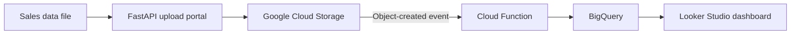
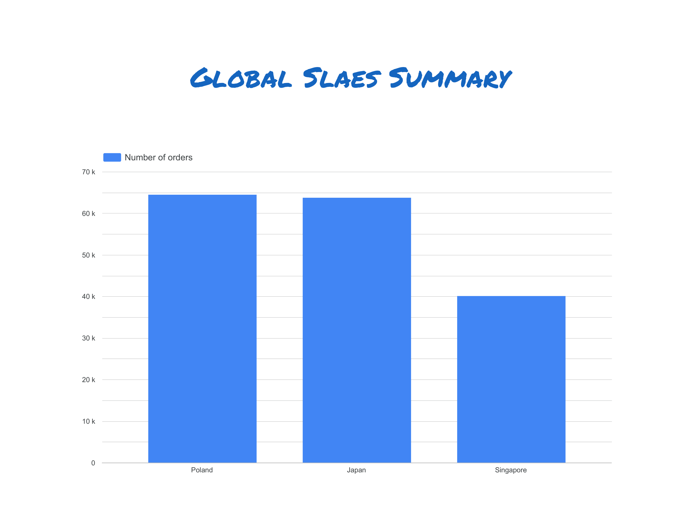

# Google Cloud Sales Data Pipeline

This project demonstrates an end-to-end sales data pipeline on Google Cloud. Sales files are submitted through a FastAPI web portal, stored in Google Cloud Storage (GCS), processed and loaded into BigQuery, and then used for reporting and analysis in Looker Studio.

## Project Overview

1. **Upload portal:** A FastAPI and Jinja2 web interface lets users select and upload sales data files.
2. **Cloud storage:** The portal writes each uploaded file to a configured GCS bucket.
3. **Automated ingestion:** A GCS-triggered Cloud Function can detect new files and start processing them.
4. **ETL and warehousing:** Sales records are extracted, transformed, and loaded into BigQuery for analysis.
5. **Reporting:** BigQuery views and Looker Studio dashboards can present key sales metrics with filters and drill-down analysis.

## Architecture




## FastAPI GCS Upload Portal

The included web application provides a simple browser-based portal for uploading files to a Google Cloud Storage bucket.


### Setup

Create and activate a virtual environment:

```bash
python -m venv .venv
source .venv/bin/activate
```

Install dependencies:

```bash
pip install -r requirements.txt
```

Configure Google Cloud credentials and the target bucket:

```bash
export GOOGLE_APPLICATION_CREDENTIALS="/path/to/service-account.json"
export GCS_BUCKET_NAME="your-bucket-name"
```

### Run the Portal

Start the FastAPI development server:

```bash
uvicorn main:app --reload
```

Open [http://127.0.0.1:8000](http://127.0.0.1:8000) in a browser, choose a file, and select **Upload to GCS**. The file is stored in the configured bucket using its original filename.


## Reporting

After the processed data is loaded into BigQuery, it can be connected to Looker Studio to build sales summaries, country comparisons, time-based trends, and other business metrics.

An example report is included below:



## Reference

This project is based on the Google Cloud sales data pipeline outlined in the [reference project video](https://youtu.be/_CQCOusfGrs) with a few changes (mainly using FastAPI instead of Flask).
